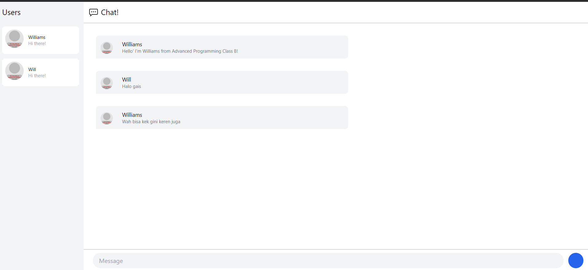
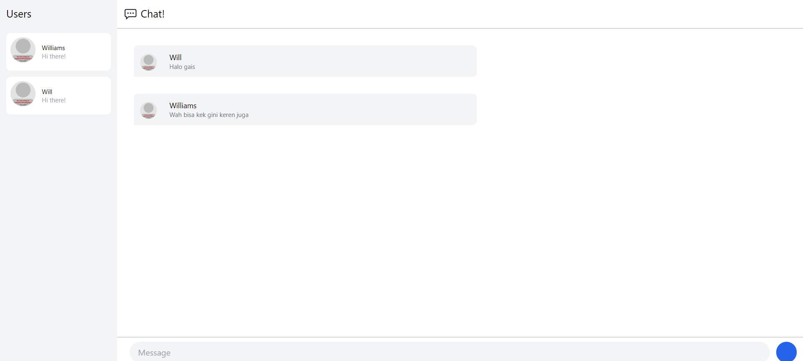
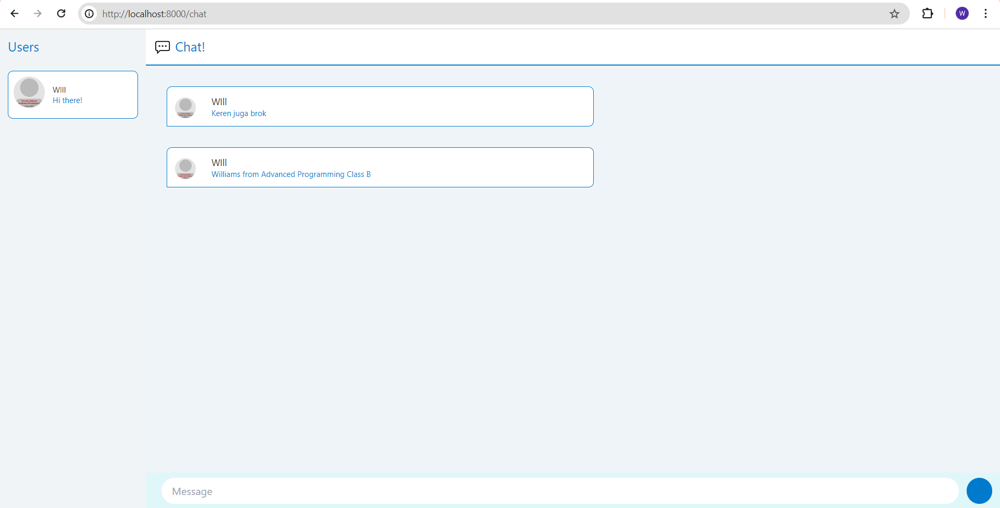

# 3.1 Original Code

Disini, saya menggunakan 2 tab halaman YewChat, di mana ketika salah satu halaman YewChat digunakan untuk mengirimkan pesan, maka halaman satunya lagi akan menerima pesan tersebut

# 3.2 Be Creative!

Disini, saya mengubah warna border menjadi biru dan mengubah warna teks menjadi biru agar lebih cerah, dan untuk box message juga terdapat background berwarna biru muda agar lebih kontras
